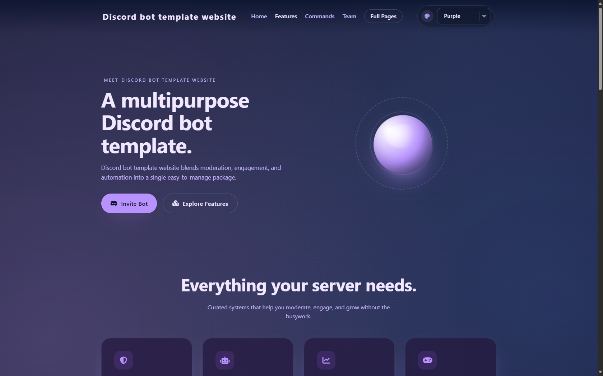
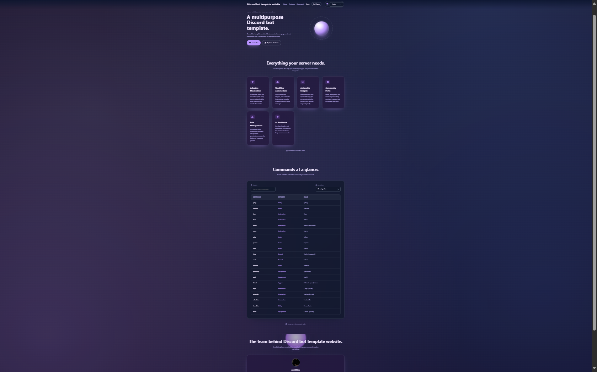
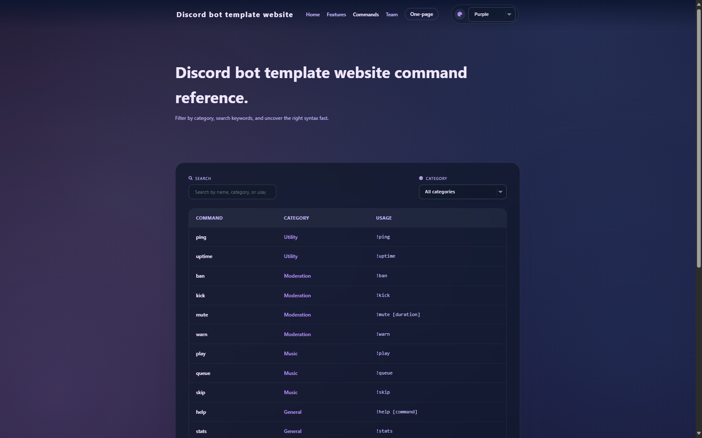
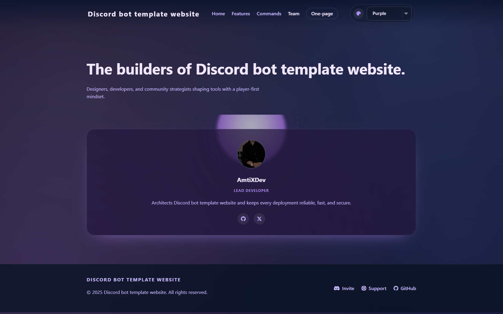

# Discord Bot Website Template


> A clean, modern, and fully customizable website template for showcasing your Discord bot — built with pure HTML, CSS, and JavaScript.



---

## 🌟 Features

- Home section with hero spotlight and concise description
- Dedicated Features, Commands, and Team sections
- Dynamic theme system (purple, void, green, yellow, blue, red)
- Command list loaded dynamically from `script.js`
- Plug-and-play customization via `settings.js` (or `settings.json`)
- Full Font Awesome icon support
- Smooth scrolling navigation between sections
- Responsive layout with polished, centered imagery
- Professional footer with invite/support links

---

## ⚙️ How to Use

1. Clone or download this repository.
2. Open `index.html` in your browser, or deploy the folder to any static host (GitHub Pages, Netlify, Vercel, etc.).
3. Update `settings.js` (or `settings.json`) to tailor the experience:
   - Bot name and tagline
   - Description text
   - Default theme/accent colour
   - Invite & support URLs
   - Command list contents
   - Team member information

```js
const settings = {
  botName: 'Discord bot template website',
  botTagline: 'A multipurpose Discord bot template.',
  botDescription: 'Discord bot template website blends moderation, engagement, and automation into a single easy-to-manage package.',
  theme: 'purple',
  inviteLink: '#',
  supportServer: 'https://discord.gg/fDkjPNN6sP',
};
```

---

## 🧠 Customization

- Update colours, spacing, typography, and component styles inside `style.css`.
- Extend or tweak commands and team data directly in `script.js`.
- Choose any of the built-in themes and the accent colours propagate across buttons, highlights, and badges automatically.

---

## 📂 Project Structure

```
/index.html
/style.css
/script.js
/settings.js
/assets/
```

---

## 📸 Preview

| Page | Description |
| ---- | ----------- |
|  | Hero area with bot introduction, quick actions, and highlights. |
|  | Searchable, filterable command directory generated from data. |
|  | Configurable team grid with avatars, roles, and social badges. |

> Replace the placeholder images above with your own screenshots or GIFs to showcase your branding.

---

## 🚀 Deployment

- Works out of the box with GitHub Pages — just publish the repository.
- Compatible with Netlify, Vercel, Cloudflare Pages, or any static web host.
- No build step required; deploy the files as-is.

---

## 🧑‍💻 Contributing

- Pull requests and issues are welcome!
- Keep commits focused, code readable, and include helpful comments where needed.
- Feel free to suggest new themes, layout improvements, or docs updates.

---

## ❤️ Support & Credits

Created with love for the Discord bot community. If you find this template useful, please **⭐ star this repo** and check out 👉 [Discord.JS v14 Handler by AmtiXDev](https://github.com/mutesuffering/Discord.JS-v14-Handler) — a fantastic command handler project that pairs perfectly with this site.

For any issues or inquiries, feel free to reach out on our Discord server:

[](https://discord.gg/fDkjPNN6sP)

---

## 📜 License

Distributed under the MIT License. See `LICENSE` for details.
